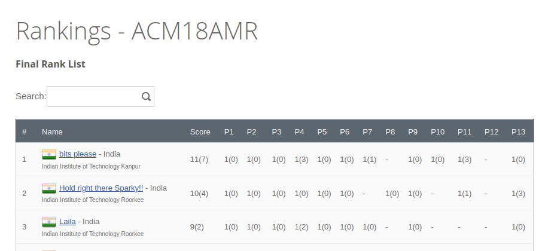
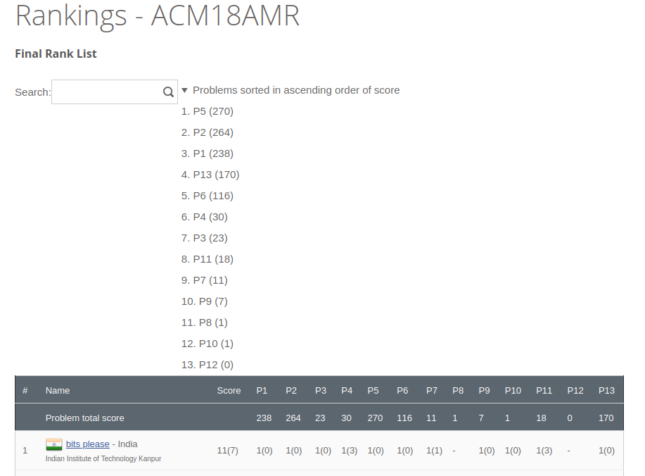

Adds a total score for each problem at the top.

## Before

## After

(the problems sorted section is by default collapsed)

## How to cross reference problem name?

In codechef contest, the replay contest problems order matches the order in which the original contest problems were given.
For example in this contest https://www.codechef.com/rankings/AMR18ROL Note the first six problems in the ranklist table.  
They are the same for the actual onsite: https://www.codechef.com/public/rankings/ACM18AMR
